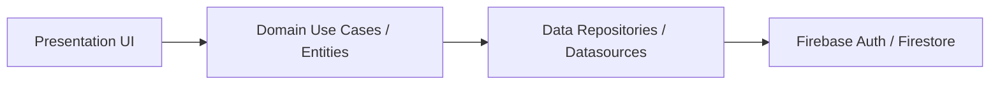
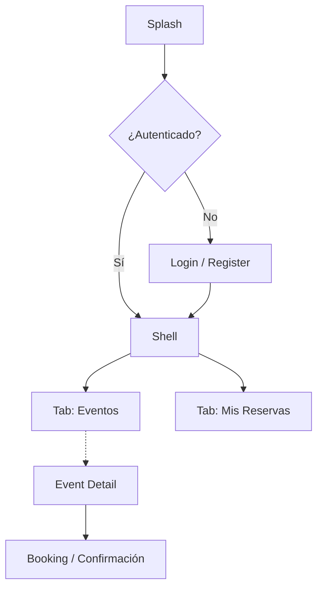
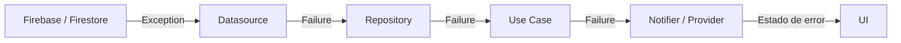
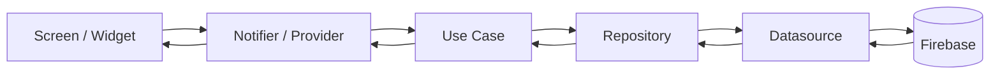

# Eventix

Eventix es una aplicación móvil Flutter para descubrir eventos, ver detalles y reservar entradas. Su propósito es ofrecer una experiencia sencilla para navegar por eventos disponibles, filtrar por categoría, ciudad y fechas, y completar reservas de forma estructurada usando Firebase como backend.

La aplicación ofrece soporte completo para **Tema Claro y Oscuro**, adaptándose automáticamente según la configuración activa en el dispositivo del usuario.

El proyecto está construido con una arquitectura limpia, organizada por features, la autenticación, la gestión de eventos y las reservas están modeladas como módulos independientes que interactúan a través de contratos y dependencias inyectadas.


## Table of Contents

- [Features](#features)
- [Screenshots](#screenshots)
- [Tech Stack](#tech-stack)
- [Project Structure](#project-structure)
- [Architecture](#architecture)
- [Navigation](#navigation)
- [Firebase Integration](#firebase-integration)
- [Error Handling](#error-handling)
- [Dependency Injection](#dependency-injection)
- [Data Flow](#data-flow)
- [Installation](#installation)
- [Licencia y Autor](#licencia-y-autor)

## Features

| Feature | Descripción |
| --- | --- |
| Autenticación | Inicio de sesión, registro y cierre de sesión mediante Firebase Authentication. |
| Eventos | Explorar eventos desde Firestore y aplicar filtros por categoría, ciudad y fecha. |
| Detalle de evento | Pantalla dedicada con capacidad, precio, fecha, ciudad y descripción del evento. |
| Reservas | Reservar tickets para un evento y validar disponibilidad antes de confirmar. |
| Mis reservas | Ver la lista de reservas actuales y pasadas del usuario. |
| Shell Navigation | Dos tabs principales que permiten navegar entre Eventos y Reservas con rutas anidadas. |
| Temas | Soporte nativo para modo claro y oscuro, sincronizado con el sistema del celular. |

## Screenshots

| Login Light | Login Dark | Events | Event Detail |
| :---: | :---: | :---: | :---: |
|  |  |  |  |
| **Filters** | **Booking** | **Payment** | **My Bookings** |
|  |  |  |  |

## Tech Stack

| Tecnología | Propósito |
| --- | --- |
| Firebase Authentication | Autenticación de usuarios y gestión de sesión. |
| Cloud Firestore | Base de datos para eventos, categorías, ciudades y reservas. |
| Riverpod | Gestión de estado e inyección de dependencias. |
| Riverpod Annotation | Generación de código para providers y notifiers. |
| Go Router | Navegación declarativa y rutas anidadas. |
| Freezed | Modelos de estado inmutables y generación de código. |
| Json Serializable | Serialización JSON para los modelos de Firestore. |
| Equatable | Comparación por valor para failures y entidades. |
| Build Runner | Herramienta de generación de código. |
| App ui kit | Componentes de UI compartidos utilizados por las pantallas. |
## Project Structure

La estructura del proyecto sigue un enfoque feature-first con un núcleo transversal bajo la carpeta core.

```text
lib/
├── core/
│   ├── constants/
│   ├── data/
│   ├── di/
│   ├── domain/
│   ├── presentation/
│   └── router/
│   └── validators/
├── features/
│   ├── auth/
│   ├── booking/
│   ├── events/
│   ├── shell/
│   └── splash/
├── firebase_options.dart
└── main.dart
```

### Qué contiene cada carpeta

- **`core`**: utilidades transversales, resultados, failures, mappers, DI base, router y validaciones reutilizables.
- **`features/auth`**: autenticación con login, registro, cierre de sesión y sus casos de uso.
- **`features/events`**: listado de eventos, filtros, detalle del evento y consumo de datos desde Firestore.
- **`features/booking`**: creación y consulta de reservas, lógica de cupos y vistas de confirmación.
- **`features/shell`**: shell principal con navegación por tabs y drawer.
- **`features/splash`**: pantalla inicial mientras se resuelve el estado de autenticación.

## Architecture

El proyecto implementa una arquitectura orientada a dominio y separada por capas, con foco en mantener la lógica de negocio independiente de Firebase y de la UI.

### Principios aplicados

- Clean Architecture: la lógica de negocio vive en la capa domain, la infraestructura en data y la interfaz en presentation.
- Feature First: cada funcionalidad se organiza en su propio módulo con dominio, data, DI y presentación.
- Inversión de dependencias: los repositorios y los datasources se exponen como interfaces y se inyectan mediante providers.
- Separación de responsabilidades: los mappers, ejecutores, failures y use cases evitan que la UI o los datasources contengan lógica de negocio excesiva.
- SOLID: la estructura favorece el principio de responsabilidad única y el uso de contratos claros.

### Diagrama de arquitectura



### Capas del proyecto

1. Presentation
  - Widgets, pages, providers Riverpod, navegación y manejo de estados de UI.
2. Domain
  - Entities, use cases, repositories abstractions, failures y params.
3. Data
  - Implementaciones de repositories, datasources, modelos, mappers y excepciones.
4. Infrastructure / Firebase
  - Firebase Authentication y Cloud Firestore como proveedores de datos y sesión.


## Navigation

La navegación se implementa con Go Router y un shell de navegación por tabs.

### Rutas principales

- `/`: Splash.
- `/login`: Login.
- `/register`: Registro.
- `/home/events`: listado de eventos.
- `/home/bookings`: listado de reservas.
- `/detail`: detalle del evento.
- `/detail/booking`: pantalla de reserva.

### Comportamiento destacado

- El router escucha los cambios de autenticación y redirige automáticamente.
- Si el usuario no está autenticado, se fuerza la navegación a login.
- Si está autenticado, se dirige a la rama principal de eventos.
- Se usa `StatefulShellRoute.indexedStack` para mantener el estado de las ramas de navegación.
- Las pantallas de detalle y reserva se encuentran fuera del Shell para ofrecer una experiencia de pantalla completa.



## Firebase Integration

La integración con Firebase se concentra en el arranque de la app y en los datasources.

### Servicios utilizados

- Firebase Authentication: sesión, inicio de sesión, registro y cierre de sesión.
- Cloud Firestore: almacenamiento de eventos, categorías, ciudades y reservas.

### Colecciones utilizadas

- `events`
- `categories`
- `cities`
- `bookings`

## Error Handling

El manejo de errores está diseñado para separar excepciones técnicas de fallos del dominio.

### Componentes involucrados

- `Result<S, E>`: wrapper de éxito o error.
- `AppFailure`: base para los failures de la app.
- `CoreFailure`: errores transversales como red, timeout, servidor o rate limit.
- `AuthFailure` y `BookingFailure`: errores específicos de cada feature.
- `DatasourceExecutor` y `RepositoryExecutor`: centralizan la captura de excepciones y la traducción a tipos de dominio.
- `Mappers:` convierten excepciones de infraestructura en failures del dominio.

### Flujo de errores



En este flujo, las excepciones técnicas se convierten en failures de dominio antes de llegar a la UI, lo que evita acoplar la interfaz a Firebase o a objetos de infraestructura.

## Dependency Injection

La inyección de dependencias se implementa mediante providers de Riverpod.

### Ejemplos

- `core_di_providers.dart`: expone `FirebaseAuth`, `FirebaseFirestore`, `authStateChanges` y los mappers core.
- `auth_di_providers.dart`: registra el datasource, repository y use cases de autenticación.
- `events_di_providers.dart`: registra el datasource, repository, mappers y use cases de eventos.
- `booking_di_providers.dart`: registra el datasource, repository y use cases de reservas.

Este diseño facilita probar cada capa por separado y reemplazar implementaciones sin modificar la lógica de negocio.

## Data Flow

El flujo de datos sigue un patrón claro desde la UI hasta Firebase y de regreso.



### Ejemplo

1. La pantalla de eventos consulta un provider.
2. El provider invoca un use case.
3. El use case delega en el repository.
4. El repository consulta un datasource.
5. El datasource lee datos desde Firestore.
6. Los modelos se transforman en entidades y regresan a la UI.

## Installation

Sigue estos pasos para ejecutar el proyecto localmente:

```bash
git clone https://github.com/eduardc23/eventix.git
cd eventix
flutter pub get
dart run build_runner build --delete-conflicting-outputs
flutter run
```

El proyecto ya incluye `lib/firebase_options.dart` con la configuración de Firebase, por lo que no es necesario ejecutar `flutterfire configure`.

## Licencia y Autor

|              |                                        |
|--------------|----------------------------------------|
| **Autor**    | [Eduard](https://github.com/eduardc23) |
| **Licencia** | [MIT](LICENSE)                         |

Este proyecto está bajo la **Licencia MIT** — puedes usarlo, modificarlo y distribuirlo libremente
con atribución.
