# Eventix

Eventix es una aplicación móvil Flutter para descubrir eventos, ver detalles y reservar entradas. Su propósito es ofrecer una experiencia sencilla para navegar por eventos disponibles, filtrar por categoría, ciudad y fechas, y completar reservas de forma estructurada usando Firebase como backend.

La aplicación ofrece soporte completo para **Tema Claro y Oscuro**, adaptándose automáticamente según la configuración activa en el dispositivo del usuario.

El proyecto está construido con una arquitectura limpia, organizada por features, la autenticación, la gestión de eventos y las reservas están modeladas como módulos independientes que interactúan a través de contratos y dependencias inyectadas.


## Table of Contents

- [Features](#features)
- [Screenshots](#screenshots)
- [Tech Stack](#tech-stack)
- [Project Structure](#project-structure)
- [Architecture](#architecture)
- [Configuración de la App](#configuración-de-la-app)
- [Navigation](#navigation)
- [Firebase Integration](#firebase-integration)
- [Error Handling](#error-handling)
- [Dependency Injection](#dependency-injection)
- [Testing](#testing)
- [Data Flow](#data-flow)
- [Installation](#installation)
- [Licencia y Autor](#licencia-y-autor)

## Features

| Feature | Descripción |
| --- | --- |
| Autenticación | Inicio de sesión, registro y cierre de sesión mediante Firebase Authentication. |
| Eventos | Explorar eventos desde Firestore y aplicar filtros por categoría, ciudad y fecha. |
| Detalle de evento | Pantalla dedicada con capacidad, precio, fecha, ciudad y descripción del evento. |
| Reservas | Reservar tickets para un evento y validar disponibilidad antes de confirmar. |
| Mis reservas | Ver la lista de reservas actuales y pasadas del usuario. |
| Shell Navigation | Dos tabs principales que permiten navegar entre Eventos y Reservas con rutas anidadas. |
| Temas | Soporte nativo para modo claro y oscuro, sincronizado con el sistema del celular. |

## Screenshots

| Login Light | Login Dark | Events | Event Detail |
| :---: | :---: | :---: | :---: |
| 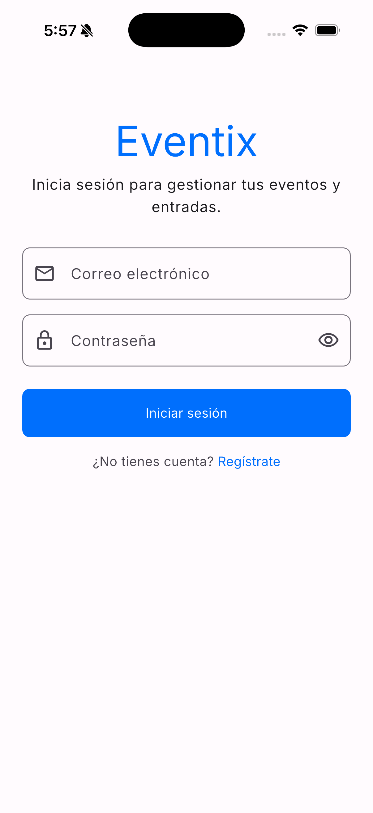 | 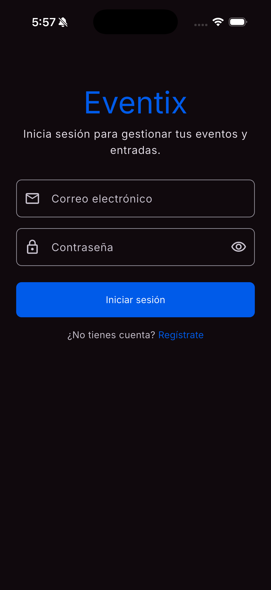 | 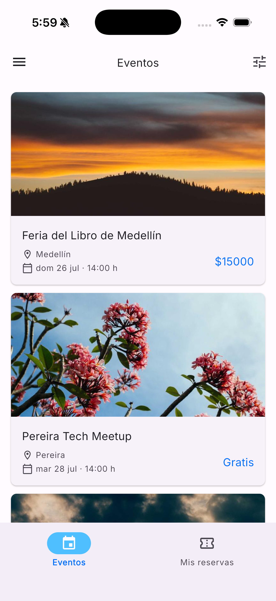 |  |
| **Filters** | **Booking** | **Payment** | **My Bookings** |
| 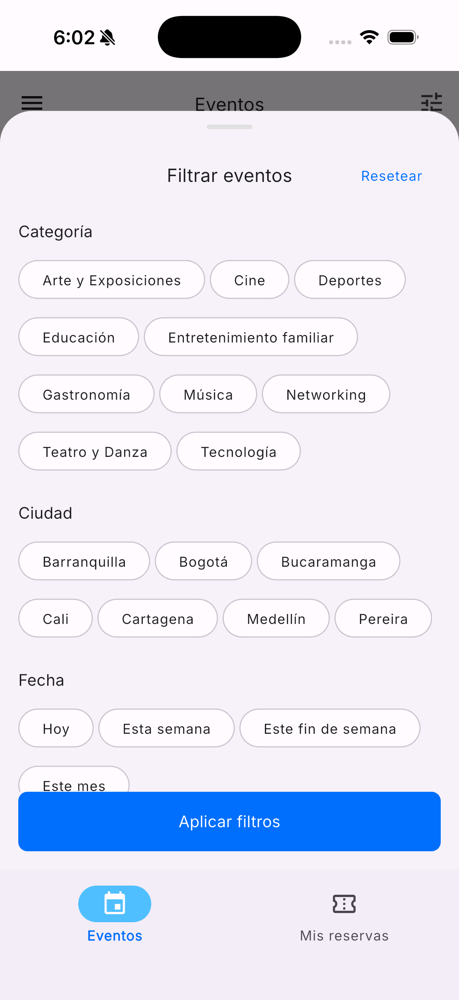 | 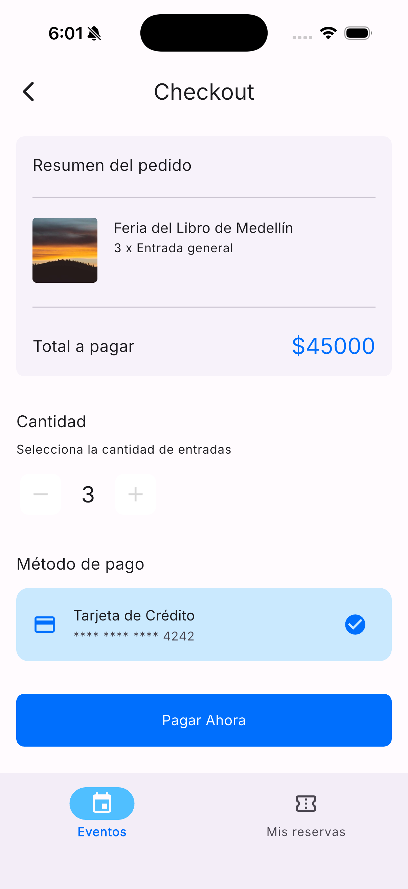 | 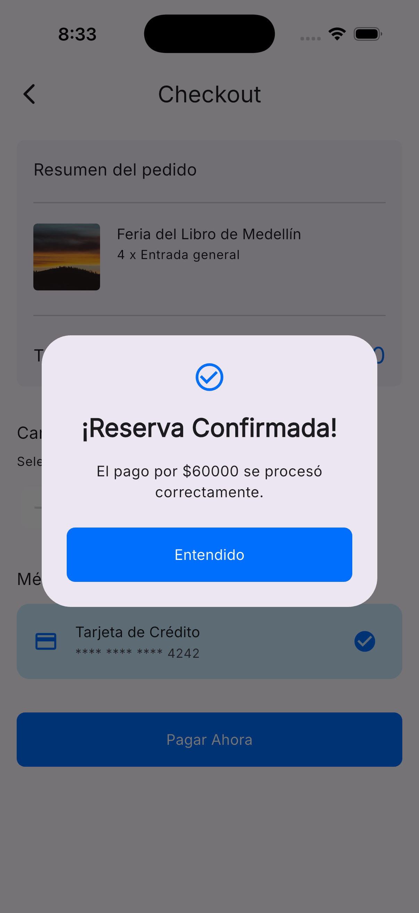 | 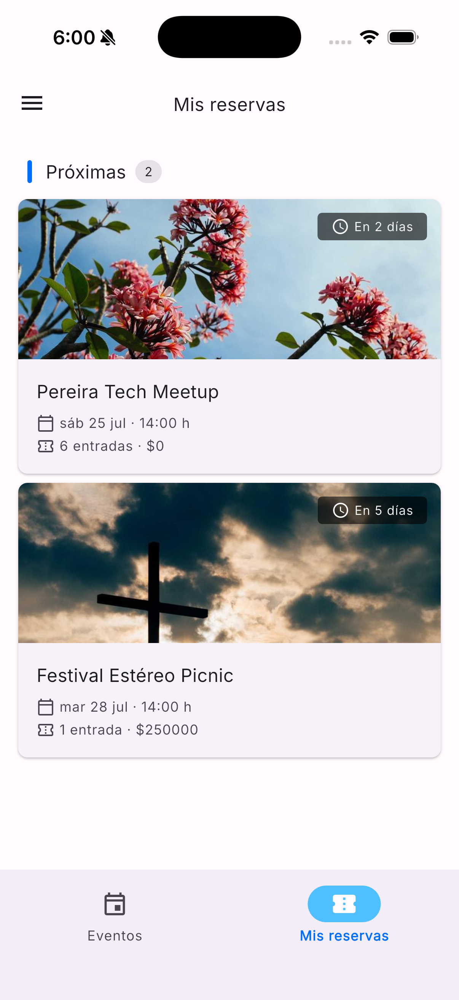 |

## Tech Stack

| Tecnología | Propósito |
| --- | --- |
| Firebase Authentication | Autenticación de usuarios y gestión de sesión. |
| Cloud Firestore | Base de datos para eventos, categorías, ciudades y reservas. |
| Riverpod | Gestión de estado e inyección de dependencias. |
| Riverpod Annotation | Generación de código para providers y notifiers. |
| Go Router | Navegación declarativa y rutas anidadas. |
| Freezed | Modelos de estado inmutables y generación de código. |
| Json Serializable | Serialización JSON para los modelos de Firestore. |
| Equatable | Comparación por valor para failures y entidades. |
| Build Runner | Herramienta de generación de código. |
| App ui kit | Componentes de UI compartidos utilizados por las pantallas. |
## Project Structure

La estructura del proyecto sigue un enfoque feature-first con un núcleo transversal bajo la carpeta core.

```text
lib/
├── core/
│   ├── config/
│   ├── constants/
│   ├── data/
│   ├── di/
│   ├── domain/
│   ├── presentation/
│   └── router/
│   └── validators/
├── features/
│   ├── auth/
│   ├── booking/
│   ├── events/
│   ├── shell/
│   └── splash/
├── firebase_options.dart
└── main.dart
```

### Qué contiene cada carpeta

- **`core`**: utilidades transversales, resultados, failures, mappers, DI base, router y validaciones reutilizables.
- **`features/auth`**: autenticación con login, registro, cierre de sesión y sus casos de uso.
- **`features/events`**: listado de eventos, filtros, detalle del evento y consumo de datos desde Firestore.
- **`features/booking`**: creación y consulta de reservas, lógica de cupos y vistas de confirmación.
- **`features/shell`**: shell principal con navegación por tabs y drawer.
- **`features/splash`**: pantalla inicial mientras se resuelve el estado de autenticación.

## Architecture

El proyecto implementa una arquitectura orientada a dominio y separada por capas, con foco en mantener la lógica de negocio independiente de Firebase y de la UI.

### Principios aplicados

- Clean Architecture: la lógica de negocio vive en la capa domain, la infraestructura en data y la interfaz en presentation.
- Feature First: cada funcionalidad se organiza en su propio módulo con dominio, data, DI y presentación.
- Inversión de dependencias: los repositorios y los datasources se exponen como interfaces y se inyectan mediante providers.
- Separación de responsabilidades: los mappers, ejecutores, failures y use cases evitan que la UI o los datasources contengan lógica de negocio excesiva.
- SOLID: la estructura favorece el principio de responsabilidad única y el uso de contratos claros.

### Diagrama de arquitectura

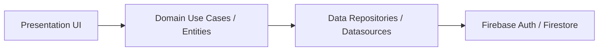

### Capas del proyecto

1. Presentation
  - Widgets, pages, providers Riverpod, navegación y manejo de estados de UI.
2. Domain
  - Entities, use cases, repositories abstractions, failures y params.
3. Data
  - Implementaciones de repositories, datasources, modelos, mappers y excepciones.
4. Infrastructure / Firebase
  - Firebase Authentication y Cloud Firestore como proveedores de datos y sesión.

## Configuración de la App

Los textos, nombres de secciones, parámetros visuales y estados vacíos están
centralizados en un único asset JSON (`assets/config/app_config.json`)

### Estructura del JSON

| Clave           | Descripción                                      |
|-----------------|--------------------------------------------------|
| `app`           | Nombre de la app                                 |
| `config.ui`     | Parámetros visuales (tamaños de sheet, rangos)   |
| `sections`      | Títulos de las pantallas                         |
| `welcomeTexts`  | Textos de login y registro                       |
| `alerts`        | Mensajes de confirmación y feedback              |
| `emptyMessages` | Títulos y descripciones de estados vacíos        |
| `defaults`      | Valores locales por defecto para catálogos       |

### Cómo funciona

El JSON se carga una única vez al inicio de la app mediante `AppConfigLoader`
y se inyecta en el `ProviderScope` de Riverpod como override, quedando
disponible en todo el árbol de widgets sin necesidad de pasarlo por parámetros.

Además de textos y parámetros visuales, este asset también puede exponer
valores locales por defecto para catálogos. En el caso de categorías, esos
defaults se usan solo en el estado inicial mientras la app consulta al backend;
cuando llega la respuesta remota, esa información reemplaza al valor local.

### Uso en widgets

La extensión `AppConfigX` sobre `WidgetRef` expone accesos directos
a cada sección de la config, evitando repetir `ref.read(appConfigProvider)`
en cada widget:

```dart
// core/config/app_config_extension.dart
extension AppConfigX on WidgetRef {
  AppConfig get appConfig => read(appConfigProvider);

  UiConfig get uiConfig       => read(appConfigProvider).config;
  Sections get sections       => read(appConfigProvider).sections;
  WelcomeTexts get welcomeTexts => read(appConfigProvider).welcomeTexts;
  Alerts get alerts           => read(appConfigProvider).alerts;
  EmptyMessages get emptyMessages => read(appConfigProvider).emptyMessages;
}
```

Los widgets que extiendan `ConsumerWidget` tienen acceso inmediato
a través de `ref` sin imports adicionales de providers:

```dart
// Acceso a textos de bienvenida
class LoginPage extends ConsumerWidget {
  @override
  Widget build(BuildContext context, WidgetRef ref) {
    final welcome = ref.welcomeTexts.login;

    return Column(
      children: [
        Text(welcome.title),
        Text(welcome.subtitle),
      ],
    );
  }
}

// Acceso a parámetros visuales
class FiltersSheet extends ConsumerWidget {
  @override
  Widget build(BuildContext context, WidgetRef ref) {
    final ui = ref.uiConfig;

    return DraggableScrollableSheet(
      initialChildSize: ui.filtersInitialSize,
      minChildSize: ui.filtersMinSize,
      maxChildSize: ui.filtersMaxSize,
      builder: (_, controller) => const FilterPanel(),
    );
  }
}

// Acceso a estados vacíos
class BookingsPage extends ConsumerWidget {
  @override
  Widget build(BuildContext context, WidgetRef ref) {
    final empty = ref.emptyMessages.bookings;

    return EmptyStateWidget(
      title: empty.title,
      description: empty.description,
    );
  }
}
```

### Agregar nuevos valores de configuración

1. Añade la clave en `assets/config/app_config.json`
2. Añade el campo al modelo correspondiente en `core/config/models/`
3. Actualiza el `fromJson` de ese modelo
4. Opcionalmente expón un acceso directo en `app_config_extension.dart`
## Navigation

La navegación se implementa con Go Router y un shell de navegación por tabs.

### Rutas principales

- `/`: Splash.
- `/login`: Login.
- `/register`: Registro.
- `/home/events`: listado de eventos.
- `/home/bookings`: listado de reservas.
- `/detail`: detalle del evento.
- `/detail/booking`: pantalla de reserva.

### Comportamiento destacado

- El router escucha los cambios de autenticación y redirige automáticamente.
- Si el usuario no está autenticado, se fuerza la navegación a login.
- Si está autenticado, se dirige a la rama principal de eventos.
- Se usa `StatefulShellRoute.indexedStack` para mantener el estado de las ramas de navegación.
- Las pantallas de detalle y reserva se encuentran fuera del Shell para ofrecer una experiencia de pantalla completa.

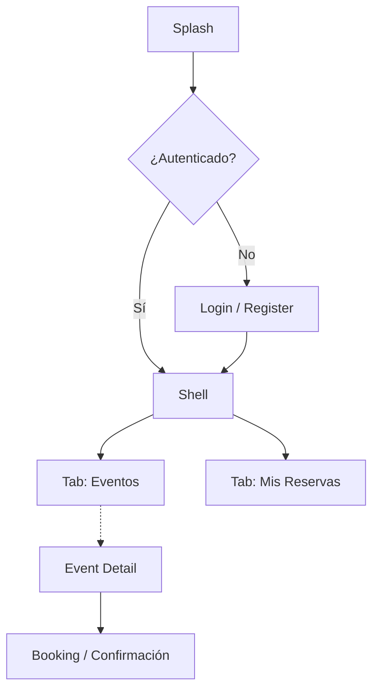

## Firebase Integration

La integración con Firebase se concentra en el arranque de la app y en los datasources.

### Servicios utilizados

- Firebase Authentication: sesión, inicio de sesión, registro y cierre de sesión.
- Cloud Firestore: almacenamiento de eventos, categorías, ciudades y reservas.

### Colecciones utilizadas

- `events`
- `categories`
- `cities`
- `bookings`

## Error Handling

El manejo de errores está diseñado para separar excepciones técnicas de fallos del dominio.

### Componentes involucrados

- `Result<S, E>`: wrapper de éxito o error.
- `AppFailure`: base para los failures de la app.
- `CoreFailure`: errores transversales como red, timeout, servidor o rate limit.
- `AuthFailure` y `BookingFailure`: errores específicos de cada feature.
- `DatasourceExecutor` y `RepositoryExecutor`: centralizan la captura de excepciones y la traducción a tipos de dominio.
- `Mappers:` convierten excepciones de infraestructura en failures del dominio.

### Flujo de errores

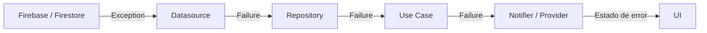

En este flujo, las excepciones técnicas se convierten en failures de dominio antes de llegar a la UI, lo que evita acoplar la interfaz a Firebase o a objetos de infraestructura.

## Dependency Injection

La inyección de dependencias se implementa mediante providers de Riverpod.

### Ejemplos

- `core_di_providers.dart`: expone `FirebaseAuth`, `FirebaseFirestore`, `authStateChanges` y los mappers core.
- `auth_di_providers.dart`: registra el datasource, repository y use cases de autenticación.
- `events_di_providers.dart`: registra el datasource, repository, mappers y use cases de eventos.
- `booking_di_providers.dart`: registra el datasource, repository y use cases de reservas.

Este diseño facilita probar cada capa por separado y reemplazar implementaciones sin modificar la lógica de negocio.

## Testing

El proyecto tiene una estrategia de testing por capas que cubre lógica de negocio, estado y UI de forma aislada, y flujos completos con Firebase emulado.

| Tipo | Ubicación | Qué valida |
|---|---|---|
| Unit | `test/` | Reglas de negocio, validadores, mappers y contratos de capas |
| Widget | `test/` | Renderizado, interacción y transiciones de estado en UI |
| Integration | `integration_test/` | Flujos completos con dependencias reales de Firebase emulado |

---

### Unit & Widget Tests

Viven bajo `test/` y validan lógica y UI de forma aislada.

**Qué se prueba:**

- **Core:** validadores, wrappers de resultado, excepciones/failures y sus mappers, utilidades de ejecución de datasource/repository, y reglas de enrutamiento y redirección de autenticación.
- **Auth:** datasource, repository, use cases, providers, validaciones y pantallas de login/registro.
- **Events:** datasource, repository, use cases, filtros, notifiers, extensiones y widgets/páginas de listado y detalle.
- **Booking:** datasource, repository, use cases, providers, extensiones y UI de checkout/listado.
- **Shell y Splash:** renderizado y comportamiento principal de navegación/estado inicial.

**Helpers compartidos:**

- `PumpApp`: extensión de `WidgetTester` para montar widgets con `ProviderScope` y `MaterialApp` de forma homogénea. Centraliza overrides por test, tema del proyecto e inicialización opcional de internacionalización con `setupIntl`.
- `RiverpodHelpers`: creación de `ProviderContainer` de test con teardown automático.
- `Fakes`: fakes compartidos de infraestructura y de fallos de dominio.
- `Mocks`: barrel de mocks comunes, con submódulos por feature (`AuthMocks`, `EventsMocks`, `BookingMocks`).
- `JsonReader`: lectura de fixtures JSON para modelos.

**Uso de `fake_cloud_firestore` en testing:**

- Se agregó `fake_cloud_firestore` como dependencia de desarrollo para probar datasources de Firestore con una base en memoria, sin red.
- Fue necesario porque en Dart 3 algunas clases del SDK de Firestore (por ejemplo, `Query`) son `sealed`, por lo que no se pueden mockear con `implements` de forma segura en tests.
- Beneficios principales:
  - Reduce fragilidad de tests al validar comportamiento real de consultas (`where`, `orderBy`, `get`) en lugar de cadenas de mocks.
  - Mejora mantenibilidad frente a cambios del SDK, evitando tests acoplados a detalles internos de la API fluida.
  - Mantiene ejecución rápida y determinística en pruebas unitarias/widget al no depender de servicios externos.
  - Permite verificar resultados de negocio (filtros, orden y persistencia) con menor boilerplate.

**Convenciones con Riverpod:**

- Se priorizan overrides de providers para aislar el comportamiento de cada capa.
- El estado asíncrono se valida a través de listeners/estados emitidos, evitando esperas frágiles.
- El montaje de widgets se estandariza con `pumpApp` para reducir boilerplate y garantizar un setup uniforme entre suites.

**Cómo ejecutar:**

```bash
# Todos los tests
flutter test

# Solo core
flutter test test/core

# Solo un feature
flutter test test/features/events

# Un archivo puntual con salida detallada
flutter test test/features/auth/presentation/pages/login/login_page_test.dart -r expanded
```

---

### Integration Tests

Viven bajo `integration_test/` y validan recorridos completos de la app con Firebase emulado. No escriben ni leen datos de producción.

**Flujos cubiertos:**

- `auth_redirect_test.dart`: login y redirección al listado de eventos.
- `register_redirect_test.dart`: registro de nuevo usuario y redirección al home.
- `logout_from_home_test.dart`: cierre de sesión desde el home y retorno al login.
- `home_events_load_test.dart`: redirccion a home con un usuario auntenticado y validación de la carga de eventos.
- `booking_flow_test.dart`: selección de evento, reserva y redirección a Mis reservas.
- `booking_no_spots_test.dart`: validación de error cuando no hay cupos disponibles durante la reserva.

**Aislamiento de producción:**

- Firebase Auth y Firestore se redirigen explícitamente a emuladores con `useAuthEmulator` y `useFirestoreEmulator`.
- Los datos (`events`, `bookings`) se siembran y limpian antes/después de cada test.
- Los usuarios de prueba se crean en Auth emulado y no afectan usuarios reales.

Los helpers `IntegrationTestHelpers` e `IntegrationTestConstants` centralizan el setup y los valores repetidos entre flujos.

**Cómo ejecutar:**

Primero, levantar los emuladores:

```bash
pkill -f "firebase emulators" || true
pkill -f "java.*Firestore" || true
firebase emulators:start --only auth,firestore --project eventix-8cb23
```

Luego, en otra terminal:

```bash
flutter test integration_test
```

---

### Coverage

El proyecto usa LCOV para filtrar y reportar cobertura de forma portable en CI/local.

```bash
# Generar cobertura base
flutter test --coverage

# Excluir archivos autogenerados
lcov -r coverage/lcov.info "lib/*.g.dart" -o coverage/lcov.info

# Generar reporte HTML
genhtml coverage/lcov.info -o coverage/html

# Abrir el reporte
open coverage/html/index.html       # macOS
xdg-open coverage/html/index.html  # Linux
```

Para instalar `lcov`:

```bash
brew install lcov       # macOS
sudo apt install lcov  # Ubuntu / Debian
```

## Data Flow

El flujo de datos sigue un patrón claro desde la UI hasta Firebase y de regreso.

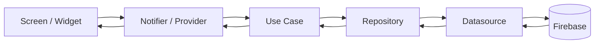

### Ejemplo

1. La pantalla de eventos consulta un provider.
2. El provider invoca un use case.
3. El use case delega en el repository.
4. El repository consulta un datasource.
5. El datasource lee datos desde Firestore.
6. Los modelos se transforman en entidades y regresan a la UI.

## Installation

Sigue estos pasos para ejecutar el proyecto localmente:

```bash
git clone https://github.com/eduardc23/eventix.git
cd eventix
flutter pub get
dart run build_runner build --delete-conflicting-outputs
flutter run
```

El proyecto ya incluye `lib/firebase_options.dart` con la configuración de Firebase, por lo que no es necesario ejecutar `flutterfire configure`.

## Licencia y Autor

|              |                                        |
|--------------|----------------------------------------|
| **Autor**    | [Eduard](https://github.com/eduardc23) |
| **Licencia** | [MIT](LICENSE)                         |

Este proyecto está bajo la **Licencia MIT** — puedes usarlo, modificarlo y distribuirlo libremente
con atribución.
